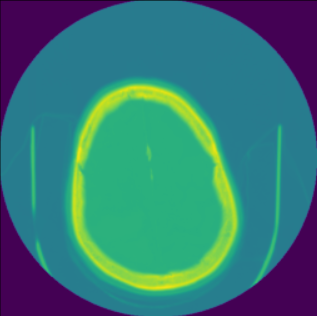

# CT Scan Analysis using Deep Learning
This project focuses on **CT Scan Analysis** using Deep Learning. The processing steps include:
1. **Loading and visualizing raw DICOM images**
2. **Applying windowing techniques**
3. **Converting to 3-channel image format**
4. **Extracting features based on different band ranges**
5. **Performing segmentation to detect regions of interest**

The project is implemented in **Python** using:
- `Pydicom` for DICOM processing
- `OpenCV & NumPy` for image manipulation
- `TensorFlow/Keras` for deep learning segmentation

## 📸 **Step-by-Step Image Processing**
Below are the transformations applied to the CT scan images:

### **1️⃣ Raw DICOM Image**
This is the **original DICOM** scan before preprocessing.

---
2️⃣3️⃣4️⃣5️⃣

### **2️⃣ 3-Channel RGB Conversion**
Since medical images are grayscale, they are **converted into 3-channel format** for deep learning compatibility.

  

---

### **3️⃣ Feature Extraction Based on Band Ranges**
Different **HU (Hounsfield Unit) ranges** highlight different tissue types.

#### **a) Band Range 40 - 100 (Soft Tissues)**
Extracting only soft tissues from the CT scan.

  

#### **b) Band Range 400 - 1600 (Bones)**
This range isolates **bone structures** in the CT scan.

  

---

### **4️⃣ Final Segmentation Output**
A deep learning model is applied for **organ/tumor segmentation**.

  

!(images/segmentaion.png)
---
